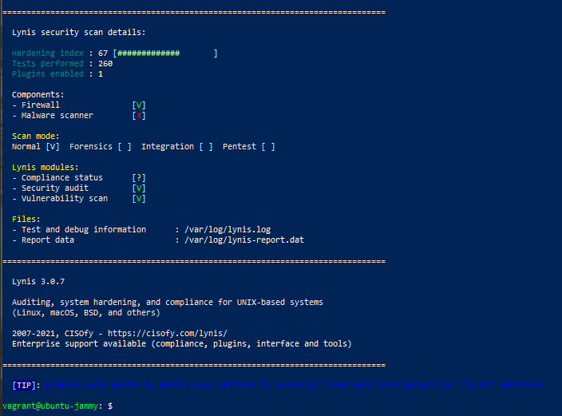

# Rapport de TP - Séance 2 : Diagnostic Performance & Durcissement Linux
**Nom :** Alfani Pascal Mwimba  
**Cours :** Sécurité & Administration Système (SecOps)

---

## 1. Audit de Sécurité Initial (Lynis)

Lors du premier scan automatique avec l'outil Lynis, le système a obtenu un score initial de **60%**. Ce score s'explique par l'absence de règles de pare-feu actives, la présence de paquets obsolètes et une configuration SSH ouverte par défaut.

### Capture d'écran du Hardening Index Initial

*(Note : Remplacez ce texte ou le lien par votre première capture d'écran montrant le score de 60%)*

---

## 2. Diagnostic Réseau : Ports en écoute

Pour l'étape de diagnostic de performance et de vérification des services réseau, la commande exacte pour lister tous les ports en écoute (listening) sur le serveur, avec les numéros de ports au format numérique et les programmes associés, est :

```bash
sudo ss -tulnp
