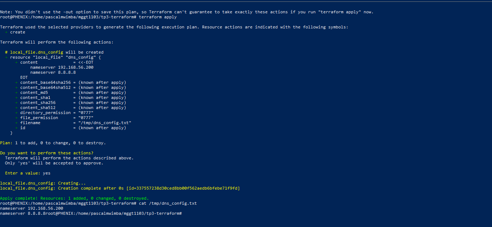

# Rapport de Travaux Pratiques — Séance 3 : Maîtriser l'Infrastructure-as-Code (IaC) avec Terraform
**Cours :** Administration Système, Cloud-Native & DevOps  
**Enseignant :** Dr. NIBITANGA Romeo  
**Étudiant :** Alfani Pascal Mwimba  
**Université :** Université Espoir d'Afrique  

---

## 1. Approche Déclarative vs Approche Impérative en IaC

Dans l'Infrastructure-as-Code (IaC), l'approche impérative consiste à définir explicitement la suite d'instructions et de commandes étape par étape (le "comment") pour atteindre un état, un peu comme un script Bash classique. 

À l'inverse, l'approche déclarative (utilisée par Terraform) se focalise uniquement sur la description de la cible finale souhaitée (le "quoi"). L'administrateur déclare l'état final attendu dans les fichiers de configuration, et c'est le moteur de Terraform qui calcule automatiquement les actions nécessaires pour appliquer, modifier ou détruire les ressources afin d'atteindre exactement cet état.

---

## 2. Validation de l'Exécution (Capture d'Écran)

Voici la validation de la création et du déploiement de notre infrastructure locale via Terraform. Le fichier généré `/tmp/dns_config.txt` contient bien les adresses IP configurées dynamiquement par nos variables.

---

## 3. Sécurité et Dangers du Fichier d'État `terraform.tfstate`

Le fichier d'état `terraform.tfstate` est extrêmement sensible et il est crucial de ne jamais l'envoyer sur un dépôt public en ligne pour deux raisons majeures :

1. **Exposition de données sensibles et secrets :** Ce fichier JSON contient une cartographie claire et en texte brut de toute l'infrastructure (adresses IP privées, configurations internes, identifiants, et même parfois des mots de passe ou clés d'accès générés automatiquement par les providers).
2. **Conflits et corruption de l'infrastructure :** C'est la mémoire vivante de Terraform. Si plusieurs personnes modifient ou corrompent ce fichier à la main ou via des versions obsolètes poussées sur Git, Terraform perd le suivi des ressources réelles, ce qui peut provoquer des crashs critiques ou des destructions involontaires de serveurs en production.
